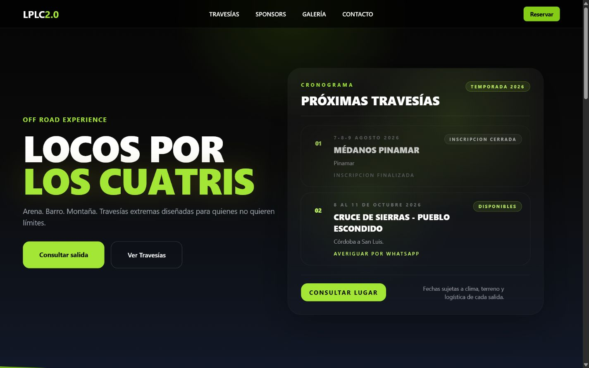
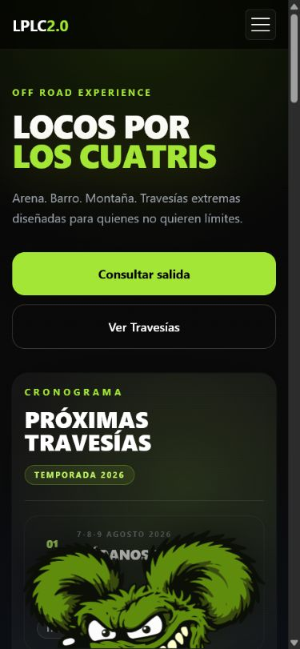

# Locos por los Cuatris 2.0

Sitio web responsive para presentar travesías en cuatriciclo, ATV y UTV, centralizar consultas por WhatsApp, mostrar próximas salidas, ordenar galerías por terreno y dar visibilidad a sponsors del proyecto.

## Estado del deploy

La URL de demo final debe confirmarse antes de compartir el portfolio con reclutadores o clientes. Durante la auditoría se detectó que una URL de Vercel asociada al portfolio podía responder 404, por lo que el enlace externo del desarrollador fue desactivado temporalmente en la app hasta contar con una URL vigente.

- Demo local: `http://127.0.0.1:5173/`
- Producción esperada: pendiente de URL final verificada
- Dominio configurado para SEO: `https://locosporloscuatristravesias.com`

## Problema Que Resuelve

El proyecto reemplaza una presencia web dispersa por una experiencia más clara y accionable. Permite que una persona interesada entienda rápidamente qué tipo de travesías existen, vea material visual real, consulte cupos por WhatsApp y reconozca las marcas que acompañan cada salida.

## Público Objetivo

- Personas interesadas en travesías off-road.
- Usuarios de cuatriciclos, ATV y UTV que buscan salidas organizadas.
- Sponsors y marcas del rubro que necesitan presencia institucional.
- Visitantes mobile que llegan desde redes sociales y necesitan contacto rápido.

## Capturas

### Home Desktop



### Galería Mobile



## Stack

- React 19
- Vite
- React Router
- Tailwind CSS
- Framer Motion
- GSAP
- Vercel

## Funcionalidades

- Home con hero, próximas travesías, llamadas a la acción y sponsors destacados.
- Galería segmentada por tipos de salida: arena, barro, solidarias y nieve.
- Páginas de detalle para álbumes de travesías.
- Página de sponsors con enlaces externos cuando están disponibles.
- Contacto directo por WhatsApp con mensajes prearmados.
- Carga diferida de páginas y componentes pesados.
- Animaciones de transición entre rutas.
- Mascota visual integrada como parte de la identidad del proyecto.
- Metadatos SEO, Open Graph, sitemap y robots.

## Decisiones Técnicas

- Se usa `HashRouter` para evitar fallos de recarga en hosting estático.
- Las páginas principales se cargan con `lazy` y `Suspense` para reducir el bundle inicial.
- Los datos de travesías, sponsors y configuración del sitio viven en archivos separados para facilitar mantenimiento.
- Los enlaces externos se renderizan solo cuando existe una URL válida asociada.
- El layout usa utilidades responsive, `clamp()`, `min()`, grids y contenedores centrados para evitar parches por resolución.

## Responsive

El sitio fue trabajado para mobile, tablet, notebook y pantallas grandes. Se revisaron especialmente:

- Anchos de contenedores.
- Espaciados verticales.
- Alturas de hero y secciones.
- Cards con imágenes y contenido variable.
- Navegación mobile.
- Prevención de overflow horizontal.

Resoluciones auditadas durante la revisión: `320`, `375`, `430`, `768`, `820`, `1024`, `1280`, `1366`, `1440`, `1920` y `2560px`.

## SEO y Performance

- `title`, `description`, canonical y Open Graph en `index.html`.
- Componente `Seo` con datos estructurados.
- `robots.txt` y `sitemap.xml` en `public`.
- Imagen social configurada.
- Lazy loading para rutas y componentes visuales pesados.
- Build optimizado con Vite.
- Headers de seguridad configurados en `vercel.json`.
- Rewrite SPA hacia `index.html` para evitar 404 en rutas internas al desplegar.

## Instalación

```bash
npm install
npm run dev
```

Para generar una versión de producción:

```bash
npm run build
```

Para previsualizar el build:

```bash
npm run preview
```

## Verificación de Enlaces

Se revisaron enlaces internos principales en desktop y mobile desde el entorno local:

- Home
- Travesías
- Galería
- Sponsors
- Contacto
- Botones hacia WhatsApp
- Botones internos de navegación

También se detectó que el dominio `https://locosporloscuatristravesias.com` responde con un sitio anterior, no necesariamente con esta versión React. Antes de compartir el proyecto como demo pública, conviene confirmar el dominio final o actualizar la URL de producción.

## Próximas Mejoras

- Conectar el dominio final a la versión React actual.
- Actualizar la URL pública del portfolio/desarrollador cuando el deploy esté confirmado.
- Agregar capturas actualizadas después del deploy final.
- Medir Lighthouse sobre producción.
- Automatizar chequeo de enlaces externos en CI.
- Migrar a rutas limpias con `BrowserRouter` si el hosting queda configurado con rewrites estables.
